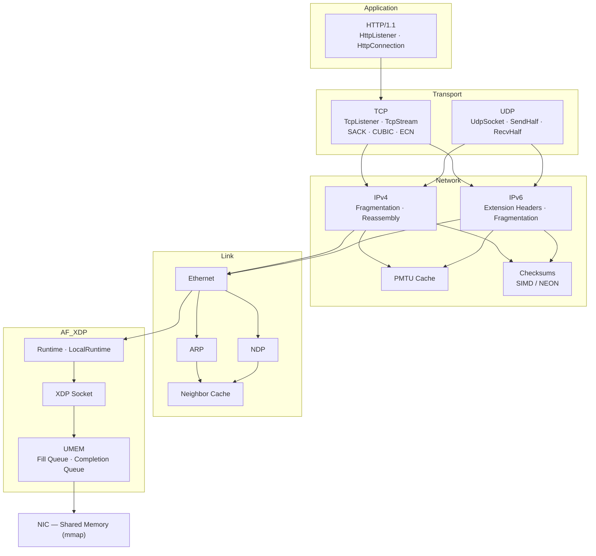

# README Redesign Implementation Plan

> **For agentic workers:** REQUIRED: Use superpowers:subagent-driven-development (if subagents available) or superpowers:executing-plans to implement this plan. Steps use checkbox (`- [ ]`) syntax for tracking.

**Goal:** Rewrite README.md to accurately present VoidNet as a full userspace networking stack with professional tone targeting Rust developers.

**Architecture:** Single file rewrite of `README.md`. No code changes, no new files beyond the README itself. Content derived from the design spec at `docs/superpowers/specs/2026-03-17-readme-redesign-design.md`.

**Tech Stack:** Markdown, Mermaid diagrams

**Spec:** `docs/superpowers/specs/2026-03-17-readme-redesign-design.md`

---

## Chunk 1: README.md Rewrite

### Task 1: Write the complete README.md

**Files:**
- Modify: `README.md`

- [ ] **Step 1: Replace README.md with the full rewritten content**

Write the following content to `README.md`:

````markdown
# voidnet

[](https://crates.io/crates/voidnet)
[](https://docs.rs/voidnet)
[](https://codecov.io/github/csaide/voidnet)

An ultra low latency and high throughput networking stack for Linux, built on [AF_XDP](https://www.kernel.org/doc/html/latest/networking/af_xdp.html).

## Overview

voidnet is a userspace networking stack that bypasses the Linux kernel's network stack entirely. Packets flow directly between the NIC and your application via shared memory — no copies, no syscall overhead, no kernel queuing delays.

On top of this foundation, voidnet provides a full protocol stack — TCP, UDP, HTTP/1.1 — with familiar async socket APIs. You get the ergonomics of `TcpListener::accept()` and `UdpSocket::recv_from()` with the performance of kernel-bypass networking.

## Features

**Application Layer**
- HTTP/1.1 server with connection keep-alive and chunked transfer encoding
- `HttpListener::serve()` convenience API with per-connection task spawning

**Transport Layer**
- **TCP** — Full implementation with SACK, CUBIC congestion control, ECN, delayed ACK, keep-alive, Nagle algorithm, and retransmission timers
- **UDP** — Bind/send/recv with split socket halves and streaming interfaces

**Network Layer**
- IPv4 and IPv6 with full fragmentation and reassembly
- Path MTU discovery with TTL-based cache (RFC 1191)
- SIMD-accelerated checksums (ARM NEON)

**Link Layer**
- ARP and NDP neighbor discovery with TTL-based cache eviction
- Ethernet frame handling

**Core**
- Zero-copy packet I/O via AF_XDP shared UMEM regions
- Async-first design with built-in runtimes
- Single-threaded (`LocalRuntime`) and multi-threaded (`Runtime`) execution modes with shared-nothing architecture — each thread owns its own XDP socket, UMEM, and protocol state, eliminating cross-thread synchronization
- Builder patterns throughout for fine-grained configuration

## Getting Started

### Requirements

- **Linux kernel** ≥ 5.4 (for full AF_XDP feature support)
- **Rust** ≥ 1.85 (2024 edition)
- **Root privileges** or `CAP_NET_RAW` + `CAP_BPF` capabilities
- **XDP-compatible NIC** (most modern drivers: `i40e`, `mlx5`, `ice`, `veth`, etc.)

> All major cloud providers are supported, including AWS, GCP, and Azure.

### Installation

Add voidnet to your `Cargo.toml`:

```toml
[dependencies]
voidnet = "0.1"
```

## Examples

<details>
<summary><b>TCP Echo Server</b></summary>

```rust
use std::sync::{Arc, atomic::{AtomicBool, Ordering}};

use libvoid::net::{socket::TcpListener, wire::ip::IpAddress};
use libvoid::rt::{LocalRuntime, spawn};

fn main() {
    let mut runtime = LocalRuntime::builder("eth0", 0)
        .build()
        .expect("Failed to create runtime");

    // Set up Ctrl-C handler for clean shutdown
    let exit = Arc::new(AtomicBool::new(false));
    ctrlc::set_handler({
        let exit = exit.clone();
        move || exit.store(true, Ordering::Relaxed)
    }).unwrap();

    runtime.run(exit, async move {
        let addr: IpAddress = "fc00:dead:cafe:1::1".parse().unwrap();
        let listener = TcpListener::listen(addr, 8080)
            .expect("Failed to listen");

        loop {
            let stream = listener.accept().await;
            spawn(async move {
                // Zero-copy splice: moves data directly from recv to send buffer
                loop {
                    match stream.splice(65535).await {
                        Ok(0) | Err(_) => break,
                        Ok(_) => {}
                    }
                }
            });
        }
    }).expect("Failed to run");
}
```

See the [full example](examples/tcp-echo-server.rs) for the complete implementation.

</details>

<details>
<summary><b>TCP Echo Client</b></summary>

```rust
use std::sync::{Arc, atomic::{AtomicBool, Ordering}};

use libvoid::net::{socket::TcpStream, wire::ip::IpAddress};
use libvoid::rt::LocalRuntime;

fn main() {
    let mut runtime = LocalRuntime::builder("eth0", 0)
        .build()
        .expect("Failed to create runtime");

    let exit = Arc::new(AtomicBool::new(false));
    ctrlc::set_handler({
        let exit = exit.clone();
        move || exit.store(true, Ordering::Relaxed)
    }).unwrap();

    runtime.run(exit, async move {
        let local: IpAddress = "fc00:dead:cafe:1::2".parse().unwrap();
        let remote: IpAddress = "fc00:dead:cafe:1::1".parse().unwrap();

        let stream = TcpStream::connect(local, 9000, remote, 8080)
            .expect("Failed to initiate connection")
            .await
            .expect("Connection failed");

        let payload = vec![0xABu8; 64];
        let mut buf = vec![0u8; 64];

        loop {
            stream.write(&payload).await.expect("Write failed");

            let mut total = 0;
            while total < payload.len() {
                match stream.read(&mut buf[total..]).await {
                    Ok(0) => return,
                    Ok(n) => total += n,
                    Err(_) => return,
                }
            }
        }
    }).expect("Failed to run");
}
```

See the [full example](examples/tcp-echo-client.rs) for the complete implementation.

</details>

<details>
<summary><b>UDP Server</b></summary>

```rust
use std::sync::{Arc, atomic::{AtomicBool, Ordering}};

use libvoid::net::{socket::UdpSocket, wire::ip::IpAddress};
use libvoid::rt::LocalRuntime;

fn main() {
    let mut runtime = LocalRuntime::builder("eth0", 0)
        .build()
        .expect("Failed to create runtime");

    let exit = Arc::new(AtomicBool::new(false));
    ctrlc::set_handler({
        let exit = exit.clone();
        move || exit.store(true, Ordering::Relaxed)
    }).unwrap();

    runtime.run(exit, async move {
        let addr: IpAddress = "fc00:dead:cafe:1::1".parse().unwrap();
        let mut socket = UdpSocket::new(addr, 8080)
            .expect("Failed to bind");

        let (recv, mut send) = socket.split();
        loop {
            let mut packet = recv.recv_from().await;
            // Echo: swap src/dst and send back
            packet.swap_addresses();
            send.echo_immediate(packet);
        }
    }).expect("Failed to run");
}
```

See the [full example](examples/udp-server.rs) for the complete implementation.

</details>

<details>
<summary><b>UDP Client</b></summary>

```rust
use std::sync::{Arc, atomic::{AtomicBool, Ordering}};

use libvoid::net::{socket::UdpSocket, wire::ip::IpAddress};
use libvoid::rt::LocalRuntime;

fn main() {
    let mut runtime = LocalRuntime::builder("eth0", 0)
        .build()
        .expect("Failed to create runtime");

    let exit = Arc::new(AtomicBool::new(false));
    ctrlc::set_handler({
        let exit = exit.clone();
        move || exit.store(true, Ordering::Relaxed)
    }).unwrap();

    runtime.run(exit, async move {
        let local: IpAddress = "fc00:dead:cafe:1::2".parse().unwrap();
        let mut socket = UdpSocket::new(local, 8080)
            .expect("Failed to bind");

        let remote: IpAddress = "fc00:dead:cafe:1::1".parse().unwrap();
        loop {
            socket.send_to(remote, 8080, b"Hello, world!").await;
        }
    }).expect("Failed to run");
}
```

See the [full example](examples/udp-client.rs) for the complete implementation.

</details>

<details>
<summary><b>HTTP Server</b></summary>

```rust
use std::sync::{Arc, atomic::{AtomicBool, Ordering}};

use libvoid::net::{http::HttpListener, wire::ip::IpAddress};
use libvoid::rt::{LocalRuntime, spawn};

fn main() {
    let mut runtime = LocalRuntime::builder("eth0", 0)
        .build()
        .expect("Failed to create runtime");

    let exit = Arc::new(AtomicBool::new(false));
    ctrlc::set_handler({
        let exit = exit.clone();
        move || exit.store(true, Ordering::Relaxed)
    }).unwrap();

    runtime.run(exit, async move {
        let addr: IpAddress = "fc00:dead:cafe:1::1".parse().unwrap();
        let listener = HttpListener::listen(addr, 8080)
            .expect("Failed to listen");

        loop {
            let mut conn = listener.accept().await.expect("Failed to accept");
            spawn(async move {
                loop {
                    match conn.next_request().await {
                        Ok(Some(req)) => {
                            let path = conn.request_path(&req);
                            let body = match path {
                                b"/" => b"Hello, World!\n" as &[u8],
                                _ => b"Not Found\n",
                            };

                            let mut writer = conn.respond(&req);
                            if writer.write_body(body).await.is_err() { break; }
                            if writer.finish().await.is_err() { break; }
                        }
                        _ => break,
                    }
                }
            });
        }
    }).expect("Failed to run");
}
```

See the [full example](examples/http-server.rs) for the complete implementation.

</details>

<details>
<summary><b>Low-level XDP</b></summary>

```rust
use std::sync::{Arc, atomic::{AtomicBool, Ordering}};

use libvoid::xdp::{
    context::XdpContext,
    frame::{BasicFrameBuffer, FrameBuffer},
    socket::Socket,
    umem::Umem,
};

fn main() {
    let mut xdp_ctx = XdpContext::builder("eth0")
        .build()
        .expect("Failed to create XDP context");

    let mut umem = Umem::builder()
        .build()
        .expect("Failed to create UMEM");

    let mut socket = Socket::builder("eth0", 0)
        .build(&mut xdp_ctx, umem.owner().clone())
        .expect("Failed to create socket");

    let exit = Arc::new(AtomicBool::new(false));
    ctrlc::set_handler({
        let exit = exit.clone();
        move || exit.store(true, Ordering::Relaxed)
    }).unwrap();

    // Prime the fill queue with buffers for the kernel
    umem.maybe_wake_fill_queue(socket.fd()).unwrap();
    let mut frames = umem.init_buffer::<BasicFrameBuffer>().unwrap();
    umem.process_fill_queue(&mut frames).unwrap();

    while !exit.load(Ordering::Relaxed) {
        if socket.recv(&mut frames).is_ok() {
            for frame in frames.iter_frames() {
                // Process raw L2 frames directly
                let _data: &[u8] = &frame;
            }

            umem.maybe_wake_fill_queue(socket.fd()).unwrap();
            umem.process_fill_queue(&mut frames).unwrap();
        }
    }
}
```

See the [full example](examples/sync-rx.rs) for the complete implementation.

</details>

## Architecture



- **`Runtime` / `LocalRuntime`** — Multi-threaded and single-threaded async runtimes with shared-nothing architecture
- **`XdpContext`** — Loads and attaches the XDP eBPF program to the network interface
- **`Umem`** — Manages shared memory regions containing packet frame buffers
- **`Socket`** — Low-level AF_XDP socket for zero-copy packet I/O

## Related Projects

- [libxdp](https://github.com/xdp-project/xdp-tools/tree/master/lib/libxdp) — C library for XDP program loading
- [xdp-tools](https://github.com/xdp-project/xdp-tools) — XDP utilities and examples
- [libbpf-rs](https://github.com/libbpf/libbpf-rs) — Rust bindings for libbpf
- [Aya](https://github.com/aya-rs/aya) — Pure Rust eBPF library
````

- [ ] **Step 2: Review the rendered output**

Visually inspect the README on GitHub or with a local markdown preview to verify:
- Badges render correctly
- Mermaid diagram renders
- All `<details>` sections expand/collapse
- Code syntax highlighting works
- Links to example files are correct

- [ ] **Step 3: Commit**

```bash
git add README.md
git commit -m "docs: rewrite README to reflect full networking stack"
```
