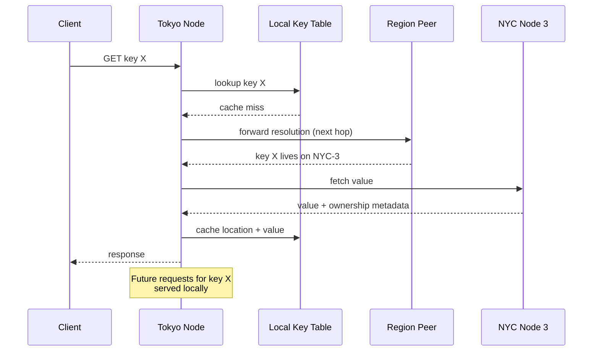
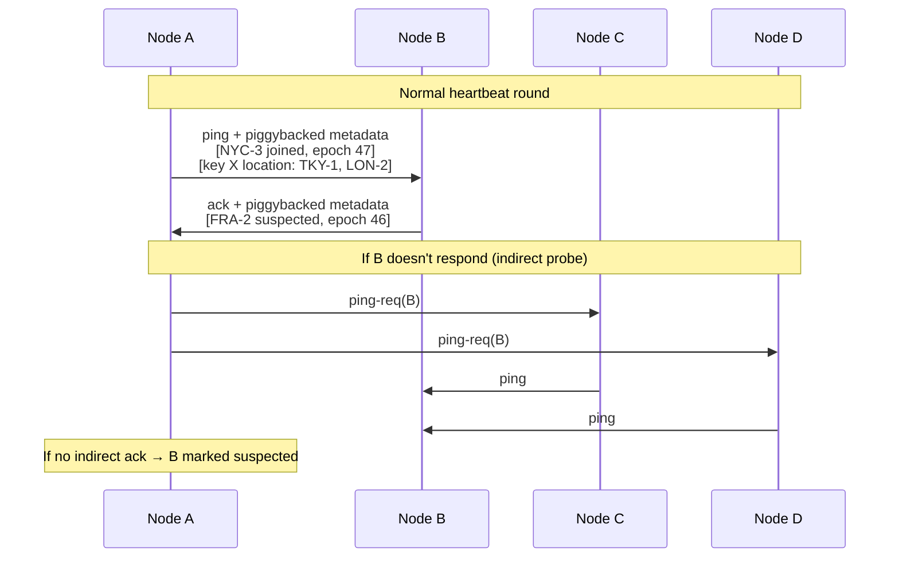
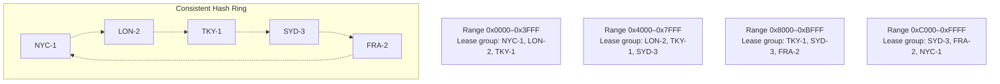
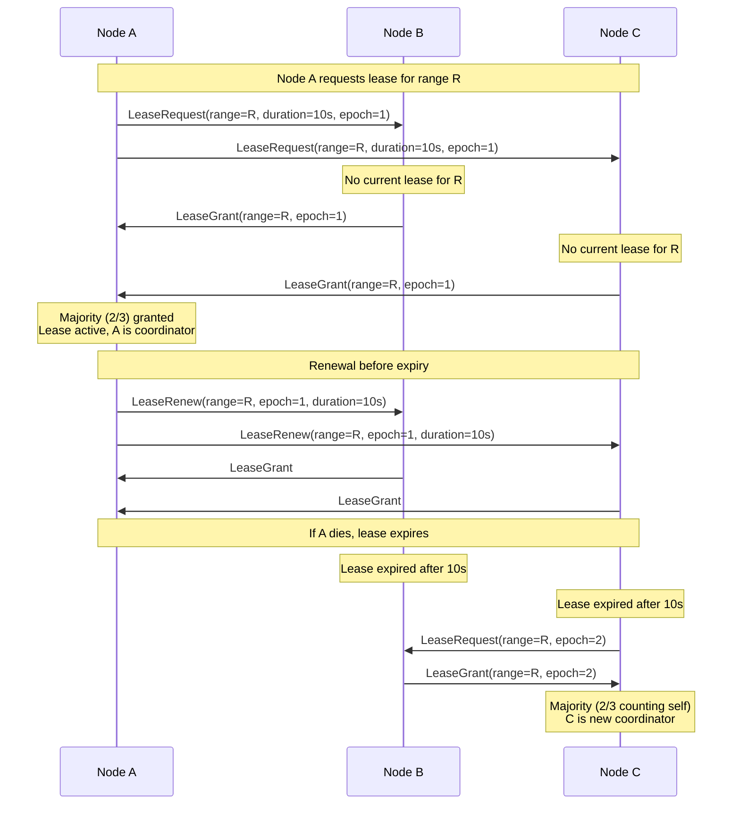
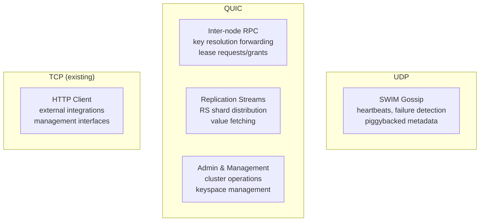
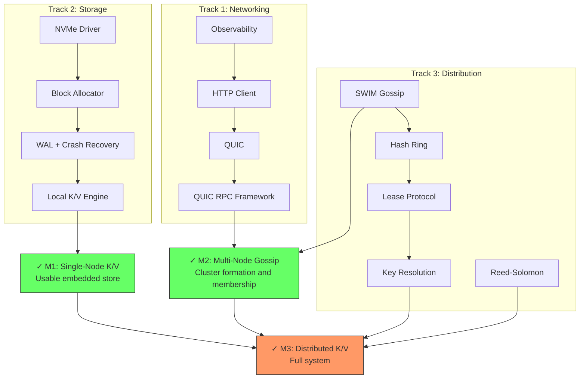

# Distributed Key-Value Store Design

## Overview

A foundational distributed key-value store built on top of libvoid's userspace network stack. This system serves as bedrock infrastructure for higher-level services: distributed storage, CDN, message queues, and an execution fabric. The design prioritizes global operation from day one, demand-driven data placement, and per-keyspace consistency guarantees.

## Motivation

libvoid provides a high-performance userspace network stack (TCP, UDP, IPv4/IPv6) via AF_XDP with zero-copy I/O. The K/V store extends this into a distributed data platform. The target services built on top are:

- **Distributed storage system** — uses the K/V store for config, file/directory/block metadata
- **Distributed queue** — sequential keys with atomic push/pop for global MPMC queues
- **Distributed CDN** — built on the storage system, content routing and metadata
- **Distributed execution fabric** — process execution orchestrated via the storage and queue systems

Each of these has different consistency, latency, and durability requirements — the K/V store must be flexible enough to support all of them without forcing a single global tradeoff.

## Key and Value Constraints

Both keys and values are arbitrary binary data with generous hard caps to prevent abuse:

- **Max key size:** ~64 KB (realistic usage: under 1 KB for all target use cases)
- **Max value size:** ~16 MB (realistic usage: under a few MB)

These caps are guard rails, not design constraints. Per-keyspace configurable caps may be added as a nice-to-have but are not required initially.

## Per-Keyspace Consistency Model

Rather than a single global consistency model, the system supports per-keyspace configuration. When creating a keyspace, the operator selects the consistency level that matches the workload.

### Three Consistency Levels

| Level | Guarantees | Use Case |
|-------|-----------|----------|
| **Linearizable** | Total ordering via coordinator-assigned sequence numbers. Reads reflect the most recent write. | Storage metadata, block allocation, queue operations |
| **Causal** | If A happened-before B, all nodes see A before B. Concurrent writes resolved by HLC + node ID tiebreak. | Cross-service coordination, session state |
| **Eventual** | Write-anywhere, gossip propagation, last-writer-wins by HLC. Stale reads acceptable. | CDN metadata, config distribution, caches |

### Three Write Ownership Modes

Each keyspace also declares a write ownership mode:

| Mode | Write Pattern | Conflict Resolution | Eviction | Use Case |
|------|--------------|---------------------|----------|----------|
| **Owned** | Single coordinator serializes writes, reads served from any replica | Coordinator-assigned sequence numbers, no conflicts possible | Coordinator controls replication, can revoke replicas | Storage metadata, block allocation tables |
| **Replicated** | Write-anywhere, propagate async | HLC last-writer-wins with node ID tiebreak | TTL or storage pressure, stale is acceptable | CDN metadata, config distribution |
| **Write-once** | Single writer creates key, value is immutable after creation | First-writer-wins via CAS at coordinator, duplicates rejected | Safe to evict anywhere (can always re-fetch, value never changes) | Queue entries, event log, append-only data |

### Valid Consistency + Ownership Combinations

Not all combinations of consistency level and write ownership mode are meaningful. The valid pairings are:

| Consistency | Owned | Replicated | Write-once |
|-------------|-------|------------|------------|
| **Linearizable** | Yes — primary use case. Coordinator serializes all writes. | No — write-anywhere is incompatible with total ordering. | Yes — coordinator handles atomic create, value is immutable after. |
| **Causal** | Yes — coordinator tracks causal dependencies via per-key version vectors. | No — causal delivery ordering requires dependency tracking that write-anywhere cannot provide without a coordination point. | Yes — immutable values have no causal ordering concerns after creation. |
| **Eventual** | No — coordinator overhead is unnecessary when stale reads are acceptable. | Yes — primary use case. Write-anywhere with HLC LWW. | Yes — immutable values with eventual location propagation. |

The system rejects invalid combinations at keyspace creation time.

### Timestamp Strategy Per Consistency Level

- **Linearizable keyspaces:** No timestamps. The coordinator assigns monotonically increasing sequence numbers. Ordering is defined entirely by the coordinator's sequence — no clock dependency, no skew ambiguity.
- **Causal keyspaces:** Coordinator-assigned per-key version vectors. The coordinator tracks causal dependencies between writes to related keys and ensures replicas apply updates in causal order. HLC timestamps are used as physical time hints but do not determine ordering — the version vector is authoritative.
- **Eventual keyspaces:** HLC with last-writer-wins. Fast, no coordination needed. Assumes nodes are NTP-synchronized to within ~100ms; larger skew does not cause incorrectness (HLC's logical component handles it) but may cause unintuitive LWW outcomes for near-simultaneous writes.

## Data Topology: Any Node Can Serve Any Request

There are no fixed roles. Every node in the cluster can accept and serve any request. The challenge is **routing** — knowing where a key currently lives.

### Demand-Driven Data Placement

Data lives where it's been requested. When a node handles a request for a key it doesn't have locally, it resolves the key's location, fetches the data, serves the client, and caches both the value and the location metadata. Over time, popular keys naturally migrate toward the nodes that use them.



**Cold start penalty:** The first request for a key from a distant region pays the full cross-region latency. Subsequent requests are local. This is an acceptable tradeoff — the system optimizes for the common case (repeated access patterns) at the cost of initial resolution.

**After resolution:** The metadata layer is updated so the key is known to live in both the origin *and* the requesting region. Any node that learns a key's location gossips that fact, so over time the entire cluster converges on knowing where popular keys live.

## Key Resolution Protocol

Modeled after network address resolution protocols (ARP for local, NDP for neighbors, BGP for global routing). Each node maintains a partial key-location index — a routing table for keys.

### Resolution Flow

1. **Local lookup** — check the node's local key table. If hit, serve directly. O(1).
2. **Forward to next hop** — if the key is unknown locally, forward the query to the node responsible for that key's range on the consistent hash ring. This structured routing bounds resolution to O(log N) hops in the worst case.
3. **Recursive resolution** — the peer either knows the location and responds, or forwards further along the ring. Resolution terminates when a node that holds the key (or knows who does) is found.
4. **Cache on resolution** — the requesting node caches the key's location. This metadata is small and can be cached aggressively.
5. **Gossip propagation** — high-traffic key location metadata is piggybacked on SWIM gossip messages, so popular key locations propagate organically without explicit broadcasts. Only "hot" key locations (those resolved above a frequency threshold) are gossiped to avoid overwhelming the protocol with cold metadata.

### Metadata vs. Data

The key insight is separating **metadata propagation** (where does key X live?) from **data transfer** (give me key X's value). Data only moves on demand. Key location metadata is propagated via two mechanisms:

- **Direct caching** — when a node resolves a key location, it caches the result locally. This is the primary mechanism and scales with access patterns.
- **Gossip piggybacking** — frequently accessed key locations are piggybacked on SWIM heartbeats so peers can pre-populate their caches. Only hot keys are gossiped to keep the protocol lightweight.

### Location Metadata Eviction

Each node's key location cache is bounded (configurable per node based on available memory). Eviction uses LRU — the least recently accessed location entries are evicted first. Eviction of a location entry does not affect the data itself; the next access simply triggers a resolution hop. TTL-based expiry ensures stale location entries (for keys that have been deleted or moved) do not persist indefinitely.

## Data Redundancy: Reed-Solomon + Full Replication

Data redundancy uses a tiered strategy based on value size:

### Tiered Redundancy Strategy

- **Small values** — full replication (copying the raw bytes is cheaper than RS encoding overhead)
- **Large values** — Reed-Solomon erasure coding. Value is split into K data shards + M parity shards. Any K of K+M shards can reconstruct the original value.
- **Block-level RS** — for workloads that group many K/V pairs (e.g., WAL segments, SSTables), RS-encode the entire block rather than individual values. Amortizes encoding cost.

The crossover point between full replication and RS encoding depends on value size and the configured RS parameters. This is a tunable per-keyspace setting.

### RS Encoding and Ownership Modes

| Mode | RS Encoding | Coordinator Role | Recovery |
|------|------------|-----------------|----------|
| **Owned/strong** | RS(K+M, K) across designated nodes | Fixed coordinator per key range, reassignable via lease | Any K shards reconstruct value, new coordinator self-elects by assembling quorum |
| **Replicated/eventual** | Full copies or RS with high M | No coordinator, write-anywhere | Any single copy or K shards suffices |
| **Write-once** | RS(K+M, K), encode once on creation | Creator is one-time coordinator | Immutable — any K shards are forever valid, no invalidation needed |

### Failure Recovery

No single node "owns" the data in the traditional sense. When a node holding shards goes down:

- Remaining nodes still have K+ shards (assuming M was chosen appropriately)
- Any node that can assemble K shards can reconstruct the value
- The system re-encodes and distributes replacement shards to restore the target redundancy level
- For linearizable keyspaces, a new coordinator is elected via the lease protocol (no data migration required — the coordinator role is about write serialization, not data storage)

## Cluster Coordination

### Gossip Protocol: SWIM

Cluster membership, failure detection, and metadata dissemination use the SWIM (Scalable Weakly-consistent Infection-style Membership) protocol over UDP.



SWIM handles three concerns in one protocol:

1. **Failure detection** — periodic pings with indirect probing detect node failures without flooding
2. **Membership dissemination** — joins, leaves, and failures propagate via infection-style piggybacking
3. **Key location metadata** — resolved key locations ride on existing heartbeat traffic

Each piece of piggybacked metadata has an "infection count" tracking how many times it's been forwarded. After sufficient rounds, all nodes have received it with high probability.

### Consistent Hash Ring

Nodes are placed on a consistent hash ring. The ring serves two purposes:

1. **Key range assignment** — determines which nodes are responsible for which key ranges (used for structured key resolution forwarding)
2. **Lease group computation** — determines which nodes form the quorum group for lease decisions on a given key range

Every node can independently compute lease group membership from the membership list. No coordination needed — the same input (membership list) produces the same output (lease groups) on every node.



### Lease-Based Coordination

For linearizable keyspaces, write ordering requires a coordinator. Rather than a persistent consensus group (Raft/Paxos), coordination uses time-bounded leases granted by majority quorum.

#### Lease Protocol



#### Key Properties

- **Majority quorum** — prevents split-brain. Two nodes cannot both hold a lease for the same range simultaneously.
- **Self-vote** — a node requesting a lease implicitly votes for itself. It needs grants from `floor(N/2)` additional nodes to achieve majority in a group of N. For a 3-node lease group, the requester needs 1 additional grant (self + 1 = 2 of 3 = majority).
- **Monotonic epochs** — a node won't grant a lease at epoch N if it already granted at epoch N or higher. Prevents stale requests from winning after partition healing.
- **Time-bounded** — leases expire automatically. No explicit revocation. Unavailability window on coordinator failure = remaining lease duration.
- **Safety margin** — the coordinator stops acting on its lease `delta` seconds before expiry, where `delta` accounts for worst-case clock skew. A 10s lease with 2s safety margin gives an effective 8s coordinator window with a guaranteed 2s gap during transitions.
- **Partition behavior** — during a network partition, the minority side cannot achieve majority quorum and must reject linearizable writes for affected ranges. Reads from locally cached data may still be served depending on the keyspace's staleness tolerance. On partition healing, the majority side's state is authoritative.
- **Self-contained** — runs entirely within libvoid over the existing network stack. No external dependencies.

#### Lease Group Membership

Lease groups are computed deterministically from the consistent hash ring. When the membership list changes (node joins/leaves propagated via SWIM), lease groups shift gradually. The ring provides stability — small membership changes cause small group changes.

## Network Architecture

### Protocol Split: UDP for Gossip, QUIC for Everything Else



**Why QUIC for inter-node communication:**

- **Multiplexed streams** — one QUIC connection between any two nodes carries many independent streams. A stalled key resolution doesn't block a concurrent lease renewal. Eliminates TCP's head-of-line blocking problem.
- **Built-in TLS 1.3** — encryption is mandatory in QUIC. Inter-node traffic is encrypted without a separate TLS implementation.
- **0-RTT reconnection** — after initial handshake, reconnections are near-instant. Critical for a system with constant inter-node chatter.
- **Natural fit** — QUIC runs over UDP, which libvoid already implements. The entire QUIC stack can be built in userspace, consistent with the project philosophy.

**Why UDP stays for gossip:**

SWIM heartbeats are tiny, fire-and-forget, one-per-peer pings. The overhead of QUIC connection setup and stream management is wasteful for this traffic pattern. SWIM was designed for raw UDP.

## Storage Engine

### Userspace NVMe (SPDK-style)

The persistent storage layer bypasses the kernel I/O stack entirely, talking directly to NVMe controllers from userspace. This is consistent with the libvoid philosophy: AF_XDP for networking, userspace NVMe for storage.

**Implications:**

- The K/V store owns the raw block device — no filesystem, no page cache, no kernel buffering
- Custom block allocator manages space on the device
- Custom on-disk format optimized for the K/V access patterns
- Custom write-ahead log (WAL) for crash recovery
- The storage engine must manage its own caching (no kernel page cache)

### Storage Engine Interface

The local storage engine exposes a trait consumed by the distribution layer:

```rust
trait StorageEngine {
    fn get(&self, key: &[u8]) -> Result<Option<Value>>;
    fn put(&mut self, key: &[u8], value: &[u8]) -> Result<()>;
    fn delete(&mut self, key: &[u8]) -> Result<()>;
    fn scan(&self, start: &[u8], end: &[u8]) -> Result<Scanner>;
}
```

This boundary allows the storage engine to be developed and tested independently of the distribution layer.

## Node Identity and Bootstrap

### Identity

- Nodes generate a unique ID on first start
- Identity is persisted to the NVMe device
- Subsequent restarts reuse the same identity

### Bootstrap

- Each node starts with a configuration file containing seed peer addresses (3-5 well-known nodes)
- On startup, the node contacts seed peers to join the cluster
- Seed peers add the new node to the membership list
- SWIM gossip propagates the new membership to all nodes
- The consistent hash ring adjusts, and lease groups shift accordingly
- Non-seed nodes can be discovered by contacting any existing cluster member

## Prerequisites and Development Roadmap

The K/V store requires several foundational capabilities in the libvoid stack before implementation can begin. Three independent workstreams can proceed in parallel.

### Track 1: Networking

| Item | Description | Dependency |
|------|-------------|------------|
| **Observability** | Metrics, distributed tracing, structured logging. Must be in place before building distributed components — retrofitting is painful. | None |
| **HTTP Client** | Completes the HTTP implementation. Needed for management interfaces and external integrations. Ships over existing TCP. | Observability |
| **QUIC Protocol** | Full QUIC implementation in userspace over existing UDP. Replaces the need for separate TLS, connection pooling, and binary framing protocol implementations. | Observability |
| **QUIC RPC Framework** | Request/response and streaming abstractions over QUIC streams. The inter-node communication API. | QUIC |

### Track 2: Storage

| Item | Description | Dependency |
|------|-------------|------------|
| **Userspace NVMe Driver** | Direct NVMe controller access from userspace, bypassing kernel block layer. | None (parallel with Track 1) |
| **Block Allocator + On-Disk Format** | Space management on raw block device, data layout for K/V pairs. | NVMe Driver |
| **WAL + Crash Recovery** | Write-ahead log for atomicity and durability, recovery on restart. | Block Allocator |
| **Local K/V Engine** | Single-node get/put/delete/scan implementing the StorageEngine trait. | WAL |

### Track 3: Distribution

| Item | Description | Dependency |
|------|-------------|------------|
| **SWIM Gossip** | Membership protocol over UDP with piggybacked metadata dissemination. | Observability |
| **Consistent Hash Ring** | Ring placement, key range assignment, deterministic lease group computation. | SWIM |
| **Lease Protocol** | Time-bounded lease acquisition, renewal, and expiry for coordinator election. | Hash Ring |
| **Key Resolution Protocol** | ARP/BGP-style key location resolution with caching and forwarding. | Lease Protocol |
| **Reed-Solomon Codec** | Erasure coding library for data redundancy. | None (standalone) |

### Integration Milestones



- **M1: Single-Node K/V** — Track 2 complete. A working embedded K/V store backed by userspace NVMe. Useful on its own and fully testable in isolation.
- **M2: Multi-Node Gossip** — Tracks 1 + 3 partially integrated. Nodes can form a cluster, detect failures, and communicate via QUIC RPC. A cluster membership and service discovery primitive.
- **M3: Distributed K/V** — All tracks converge. Full distributed K/V with per-keyspace consistency, demand-driven placement, RS redundancy, and lease-based coordination.

Each milestone delivers standalone value, not just a stepping stone.

## Design Principles

- **Self-contained** — no external dependencies. The entire system runs within libvoid's userspace stack.
- **Global from day one** — the architecture assumes varying latency, unreliable clocks, and geographically distributed nodes from the start.
- **Demand-driven placement** — data moves toward where it's used rather than being pre-sharded to fixed locations.
- **Separation of metadata and data** — key location metadata is tiny and gossiped aggressively. Values only move on demand.
- **Tame complexity** — per-keyspace consistency gives flexibility without a single monolithic consistency protocol. One read path, three write paths determined by keyspace config.
- **Bypass everything** — AF_XDP for networking, userspace NVMe for storage. The kernel is not in the data path.
